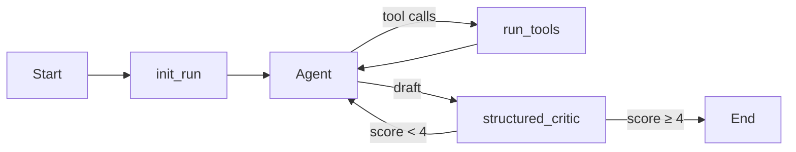

# Agentflow — Knowledge Copilot

> **Problem:** Teams store knowledge in PDFs, wikis, and text files. Finding answers means opening many documents — slow and inconsistent. Generic chatbots hallucinate policy.
>
> **Solution:** Point at a folder of documents; ingest into Chroma; ask questions via a LangGraph agent that returns **cited answers**. Support SaaS (`data/tenants/support-saas/`) is one example tenant, not the product.

## Features

- **Multi-format RAG** — ingest `.md`, `.txt`, `.pdf` into Chroma (keyword fallback)
- **LangGraph agent** — research loop with structured critic that enforces KB grounding
- **Cited answers** — `answer` + `citations[{source, snippet, file_type, page}]`
- **Next.js chat UI** — `web/` app (TypeScript, Tailwind, react-markdown)
- **Eval harness** — YAML regression suites with pass rate and latency metrics
- **FastAPI backend** — `/run/support`, streaming, supervisor graph, MCP server

## Quick start

```bash
cd agentflow
cp .env.example .env
# Set OPENAI_API_KEY

uv sync --extra dev
uv run agentflow-ingest data/knowledge --recursive
```

### Run API + web UI

```bash
# Terminal 1 — API (default port 8081)
uv run agentflow-api

# Terminal 2 — Next.js
cd web
cp .env.local.example .env.local
bun install
bun dev
# Open http://localhost:3000
```

Or use Make:

```bash
make ingest
make api      # terminal 1
make web      # terminal 2
```

## Ingest documents

```bash
# Primary knowledge base (md, txt, pdf — recursive)
uv run agentflow-ingest data/knowledge --recursive

# Example support-SaaS tenant (markdown only)
uv run agentflow-ingest data/tenants/support-saas --recursive
```

## Eval suites

```bash
# Domain-agnostic knowledge tasks (target ≥ 85%)
uv run agentflow-eval --tasks eval/tasks-knowledge.yaml

# Support SaaS tenant evals
uv run agentflow-eval --tasks eval/tasks-support-kb.yaml
```

## API examples

```bash
curl -s http://localhost:8081/health

curl -s http://localhost:8081/run/support \
  -H 'Content-Type: application/json' \
  -d '{"message":"What is the meal expense limit per day?"}'

curl -s http://localhost:8081/kb/articles
```

## Architecture

```
Next.js (web/) :3000  →  FastAPI :8081  →  LangGraph agent  →  Chroma RAG
```

### Research graph



Details: [docs/ARCHITECTURE.md](docs/ARCHITECTURE.md) · [docs/RAG.md](docs/RAG.md)

## Sample knowledge base

`data/knowledge/` — mixed formats for demos:

| Path | Format | Topics |
|------|--------|--------|
| `policies/expense-policy.md` | Markdown | Meal limits, submission deadlines |
| `policies/remote-work.md` | Markdown | Remote work eligibility |
| `notes/incident-response.txt` | Text | SEV1 response times |
| `notes/product-launch-checklist.txt` | Text | Launch windows |
| `manuals/onboarding-manual.pdf` | PDF | Laptop refresh cycle, onboarding |

## Stack

Python · LangGraph · LangChain · ChromaDB · FastAPI · Next.js · TypeScript · pypdf · uv · bun

## Development

```bash
uv run pytest tests/
uv run ruff check src/ tests/
cd web && bun run lint && bun run build
```

## Deployment

- **API:** Docker / Railway / Fly (`Dockerfile`, `docker-compose.yml`)
- **Web:** Vercel — set `NEXT_PUBLIC_API_URL` to your API URL

## License

MIT
