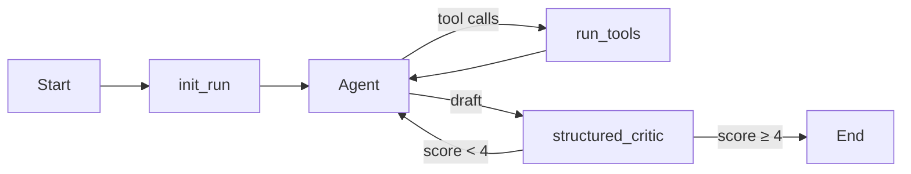
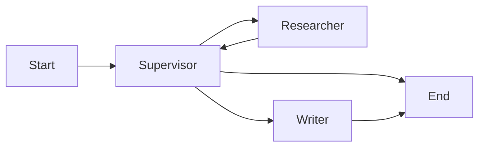

# Agentflow

LangGraph-based agent runtime with regression evals, structured traces, vector RAG, and an MCP tool server.

## Features

- **Research graph** — custom `StateGraph` with tool calling and a structured critic loop
- **Supervisor graph** — multi-agent flow (supervisor → researcher → writer)
- **Eval harness** — YAML task suite with pass rate, latency, and token estimates
- **RAG** — Chroma ingestion + retrieval with keyword fallback and source citations
- **API** — FastAPI (`/run`, `/run/supervisor`, `/run/stream`, `/eval`)
- **MCP** — same tools exposed for Cursor / Claude Desktop

## Quick start

Run these from the **agentflow** repo root (not the parent `personalprojects` folder):

```bash
cd agentflow
cp .env.example .env
# Set OPENAI_API_KEY

uv sync --extra dev
uv run agentflow-api
```

```bash
# Regression suite
uv run agentflow-eval

# Ingest docs for vector search (requires OPENAI_API_KEY)
uv run agentflow-ingest data/sample
```

## API examples

```bash
curl -s http://localhost:8080/run \
  -H 'Content-Type: application/json' \
  -d '{"message":"What is agentflow? Search local knowledge."}'

curl -s http://localhost:8080/run/supervisor \
  -H 'Content-Type: application/json' \
  -d '{"message":"Compare LangGraph and MCP in three bullets."}'

curl -s http://localhost:8080/eval
```

## Architecture

### Research graph



### Supervisor graph



Details: [docs/ARCHITECTURE.md](docs/ARCHITECTURE.md)

## RAG (Chroma)

Vector search is **on by default** (`AGENTFLOW_RETRIEVER=chroma`). Ingest markdown into a local Chroma store, then query via the `search_knowledge` tool:

```bash
uv run python -m agentflow.rag.ingest data/sample
AGENTFLOW_RETRIEVER=chroma uv run agentflow-api
```

If the Chroma collection is missing or empty, retrieval falls back to keyword search over `data/sample/*.md`.

See [docs/RAG.md](docs/RAG.md).

## MCP

```bash
uv run python -m agentflow.mcp.server
```

Setup: [mcp/README.md](mcp/README.md)

## Stack

Python · LangGraph · LangChain · ChromaDB · FastAPI · MCP SDK · uv

## Development

```bash
uv sync --extra dev
uv run pytest tests/
uv run ruff check src/ tests/
```

## License

MIT
