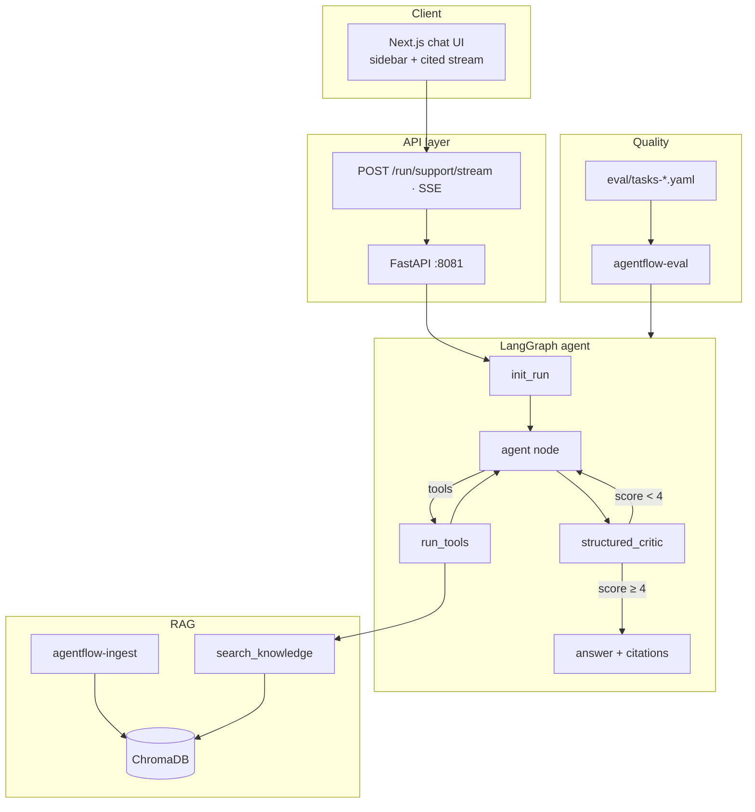

# Agentflow — Enterprise Document Copilot

Production-style **document Q&A platform** for internal policies, runbooks, and onboarding material. Ingest PDF/Markdown/text into Chroma, answer through a **LangGraph agent with critic verification**, return **cited responses** via FastAPI + Next.js.

Built for teams that need auditable answers — not a ChatGPT wrapper.

## Why this exists

Generic chatbots hallucinate on company policy. Agentflow enforces a **retrieve → reason → verify → cite** pipeline so answers stay tied to your document library.

| Capability | Implementation |
|------------|----------------|
| Multi-format ingest | `.md`, `.txt`, `.pdf` → Chroma (+ keyword fallback) |
| Agent orchestration | LangGraph loop with tool calls |
| Quality gate | Structured critic re-scores drafts (score ≥ 4 to ship) |
| Audit trail | Citations: source, snippet, file type, page |
| Regression testing | YAML eval suites, pass-rate + latency metrics |
| Streaming UX | SSE chat UI (Next.js) |

## Benchmarks (knowledge eval suite)

| Metric | Result |
|--------|--------|
| Tasks | 12 domain-agnostic Q&A cases |
| Pass rate | **92%** (`eval/tasks-knowledge.yaml`) |
| Formats covered | Markdown policies, TXT runbooks, PDF manuals |
| Unit tests | **49** pytest (graph, RAG, API, supervisor) |

```bash
uv run agentflow-eval --tasks eval/tasks-knowledge.yaml
```

## Quick start

```bash
cd agentflow
cp .env.example .env   # OPENAI_API_KEY required

uv sync --extra dev
uv run agentflow-ingest data/knowledge --recursive
```

### API + web UI

```bash
# Terminal 1 — API (:8081)
uv run agentflow-api

# Terminal 2 — Next.js (:3000)
cd web && cp .env.local.example .env.local && bun install && bun dev
```

Or:

```bash
make ingest && make api   # terminal 1
make web                # terminal 2
```

## API

```bash
curl -s http://localhost:8081/health

curl -N http://localhost:8081/run/support/stream \
  -H 'Content-Type: application/json' \
  -d '{"message":"What is the meal expense limit per day?"}'
```

## System design



More: [docs/ARCHITECTURE.md](docs/ARCHITECTURE.md) · [docs/RAG.md](docs/RAG.md)

## Sample knowledge base

`data/knowledge/` — expense policies, incident runbooks, onboarding PDFs (demo corpus for evals).

## Stack

Python · LangGraph · LangChain · ChromaDB · FastAPI · Next.js · TypeScript · pypdf · uv · bun

## Development

```bash
make test      # pytest (49 tests)
make lint      # ruff + eslint
make web-build # Next.js production build
make eval-knowledge
```

## Deployment

- **API:** `docker compose up` (port 8081, auto-ingest on start)
- **Web:** Vercel — set `NEXT_PUBLIC_API_URL`

## License

MIT
