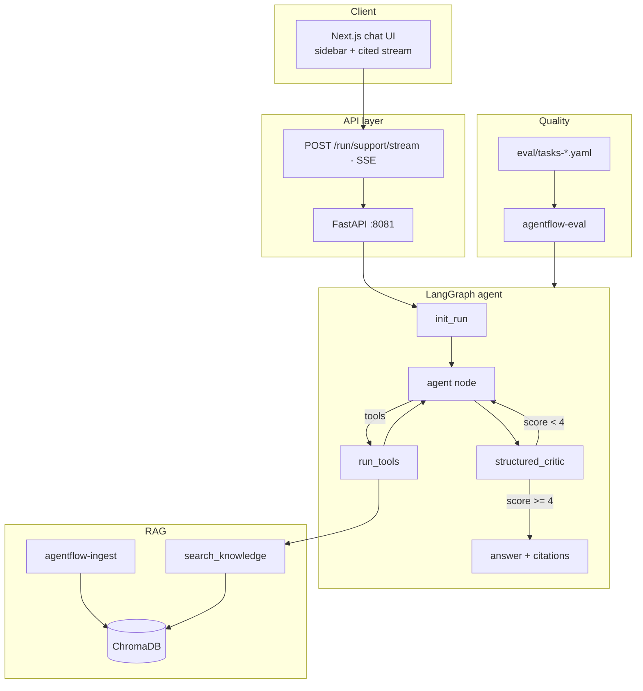

# Agentflow

Document Q&A over a private knowledge base. Ingest Markdown, text, and PDF files into Chroma, ask questions through a LangGraph agent, and get answers with citations. The agent runs a critic step before answering: drafts below a quality score go back for another pass.

CI: [](https://github.com/0xrameshh/agentflow/actions/workflows/ci.yml)

Engineering story: [CASE_STUDY.md](CASE_STUDY.md)

## What it does

- Ingest .md, .txt, .pdf into Chroma, with a keyword fallback that works without an API key
- LangGraph loop: init_run, agent, run_tools, structured_critic
- Every answer carries citations (source, page, chunk)
- FastAPI backend with SSE streaming, Next.js chat UI
- The same tools are exposed over MCP for Cursor and Claude Desktop (see [mcp/README.md](mcp/README.md))
- YAML eval suites with pass rate and latency numbers

## Numbers

- 49 pytest tests (graph, RAG, API, supervisor)
- 92% pass rate on eval/tasks-knowledge.yaml (12 Q&A cases)
- ruff clean, CI green

## Quick start

```bash
cp .env.example .env   # OPENAI_API_KEY required
uv sync --extra dev
uv run agentflow-ingest data/knowledge --recursive
uv run agentflow-eval --tasks eval/tasks-knowledge.yaml
```

### API and web UI

```bash
uv run agentflow-api              # terminal 1, port 8081
cd web && bun install && bun dev # terminal 2, port 3000
```

Or use the Makefile: `make ingest && make api`, `make web`.

## API

```bash
curl -s http://localhost:8081/health

curl -N http://localhost:8081/run/support/stream \
  -H 'Content-Type: application/json' \
  -d '{"message":"What is the meal expense limit per day?"}'
```

## System design


```mermaid
flowchart TB
    subgraph client ["Client"]
        UI["Next.js chat UI<br/>sidebar + cited stream"]
    end

    subgraph api ["API layer"]
        FastAPI["FastAPI :8081"]
        Stream["POST /run/support/stream · SSE"]
    end

    subgraph agent ["LangGraph agent"]
        Init["init_run"] --> LLM["agent node"]
        LLM -->|tools| Tools["run_tools"] --> LLM
        LLM --> Critic["structured_critic"]
        Critic -->|score < 4| LLM
        Critic -->|score >= 4| Done["answer + citations"]
    end

    subgraph rag ["RAG"]
        Ingest["agentflow-ingest"] --> Chroma[("ChromaDB")]
        Tools --> Search["search_knowledge"] --> Chroma
    end

    subgraph eval ["Quality"]
        YAML["eval/tasks-*.yaml"] --> Runner["agentflow-eval"]
    end

    UI --> Stream --> FastAPI --> Init
    Runner --> agent
```

More: [docs/ARCHITECTURE.md](docs/ARCHITECTURE.md), [docs/RAG.md](docs/RAG.md)

## Layout

```text
src/agentflow/tools/   tool implementations, shared by the agent and the MCP server
src/agentflow/rag/     Chroma retriever + keyword fallback
src/agentflow/graph/   LangGraph state machine
src/agentflow/mcp/     MCP server wrapper
src/agentflow/eval/    eval runner
tests/                 pytest suite
eval/                  YAML task suites
data/knowledge/        sample corpus: expense policies, runbooks, onboarding PDFs
```

## Development

```bash
make test          # pytest (49 tests)
make lint          # ruff + eslint
make web-build     # Next.js production build
make eval-knowledge
```

## Deployment

- API: docker compose up (port 8081, auto-ingest on start)
- Web: Vercel, set NEXT_PUBLIC_API_URL

## License

MIT
